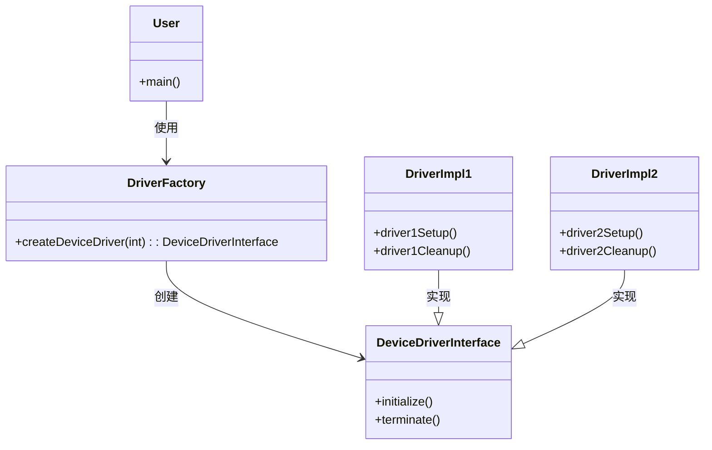
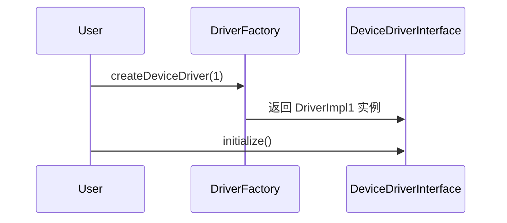

<h1>Lniux源代码使用到的创建模式例子</h1>

<h2>代码</h2>

```c
#include <linux/module.h>
#include <linux/kernel.h>

// 定义设备驱动接口结构体
// 包含初始化和退出函数指针
struct DeviceDriverInterface {
    void (*initialize)(void);
    void (*terminate)(void);
};

// 设备驱动具体实现 1
static struct DeviceDriverInterface driverImpl1 = {
    .initialize = driver1Setup,
    .terminate = driver1Cleanup
};

// 设备驱动具体实现 2
static struct DeviceDriverInterface driverImpl2 = {
    .initialize = driver2Setup,
    .terminate = driver2Cleanup
};

// 设备驱动创建工厂函数
// 根据传入的类型创建对应的设备驱动实例
struct DeviceDriverInterface* createDeviceDriver(int driverType)
{
    switch (driverType) {
    case 1:
        return &driverImpl1;
    case 2:
        return &driverImpl2;
    default:
        return NULL;
    }
}

// 模块初始化函数
// 调用工厂函数创建驱动实例并初始化
static int __init moduleStartup(void)
{
    struct DeviceDriverInterface* selectedDriver = createDeviceDriver(1);
    if (selectedDriver) {
        selectedDriver->initialize();
    }
    return 0;
}

// 模块退出函数
// 调用工厂函数创建驱动实例并执行退出操作
static void __exit moduleShutdown(void)
{
    struct DeviceDriverInterface* selectedDriver = createDeviceDriver(1);
    if (selectedDriver) {
        selectedDriver->terminate();
    }
}

module_init(moduleStartup);
module_exit(moduleShutdown);
module_init(my_module_init);
module_exit(my_module_exit);
```

<h2>UML类图</h2>



<h2>UML顺序图</h2>

